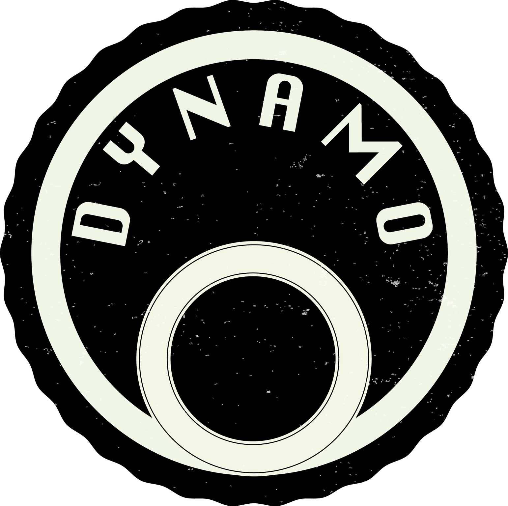

Dynamo - Dynamic Data Management System
=======================================

	   
Dynamo is a Dynamic Data Management system that organizes and optimizes large scale data usage on storage systems with distributed storage sites (storage elements). It is designed to seamlessly integrate large number of storage sites even if the individual storage sites are very different in sizes. The data are assumed to be ordered in chunks that have some clear relation (datasets), and which share some common metadata that can be used to organize their usage.

Once the data is entered into the system Dynamo policies can be set to let the system organize the data for best access. The policy language is rich and powerful and can be adjusted at runtime. Popularity is used as a metric to dynamically adjust the number of replicas for data in the system. Tape storage systems can be integrated which offers a wider variety of accessibility level and good safety against data loss.

The system has been originally designed for the CMS experiment at CERN. There were seven storage sites with tape system access (Tier-1 sites) and about 40 sites with disk only storage (Tier-2).

If you are interested in managing your data with Dynamo or contributing to the development of Dynamo, please contact the the Dynamo Team at ddm-dynamo@mit.edu. The documentation is maintained in github and compiled using Sphinx and is uploaded to readthedocs `here <https://ddm-dynamo.readthedocs.io/en/latest/>`_.
